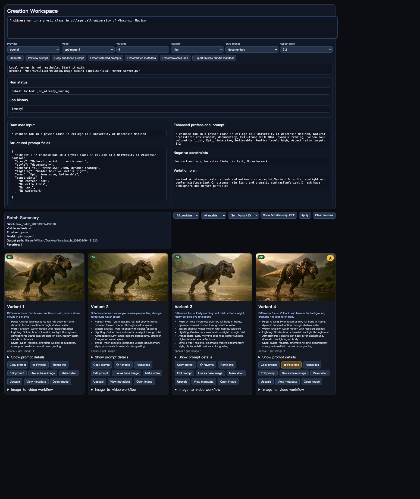

# Image Making Pipeline



Local image generation workspace with:
- Prompt studio + batch gallery UI
- Local one-click runner service (`local_runner_server.py`)
- Batch metadata + per-variant metadata
- OpenAI provider adapter (extensible)

## Run local runner

```bash
export OPENAI_API_KEY="YOUR_KEY"
python3 local_runner_server.py
```

## Run pipeline directly

```bash
python3 trex_image_pipeline.py --count 4
# or
python3 trex_image_pipeline.py --request-file ~/Downloads/studio_request.json
```
